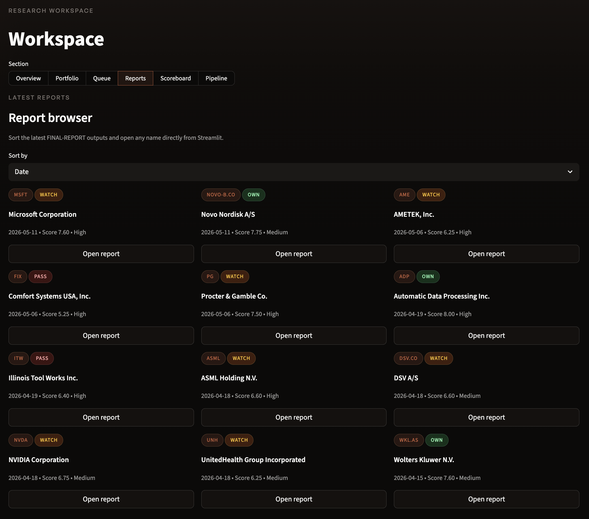
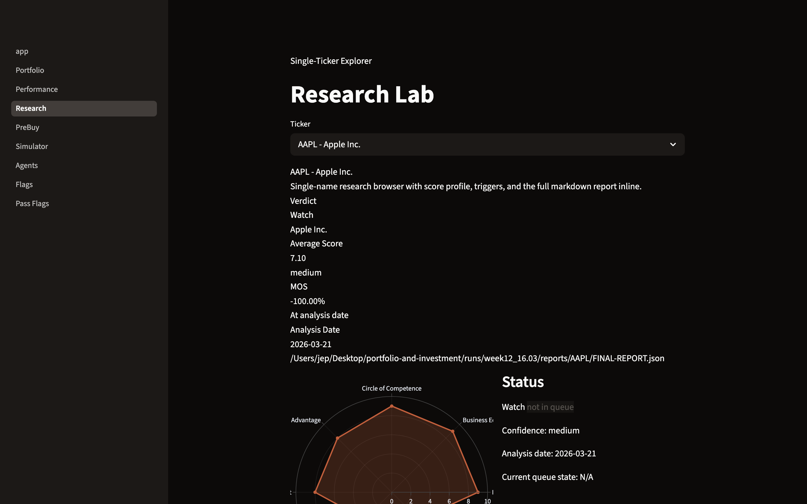
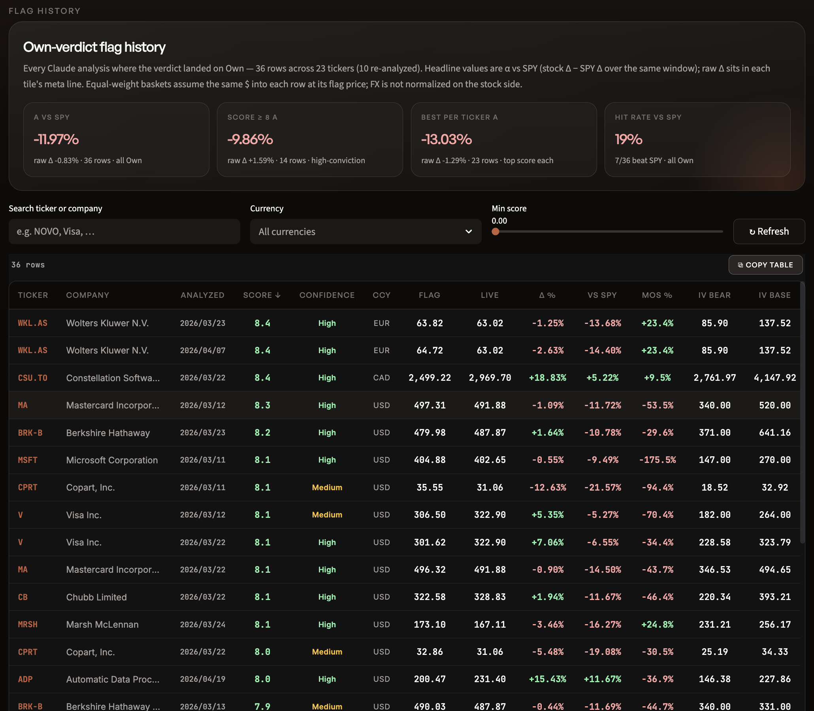
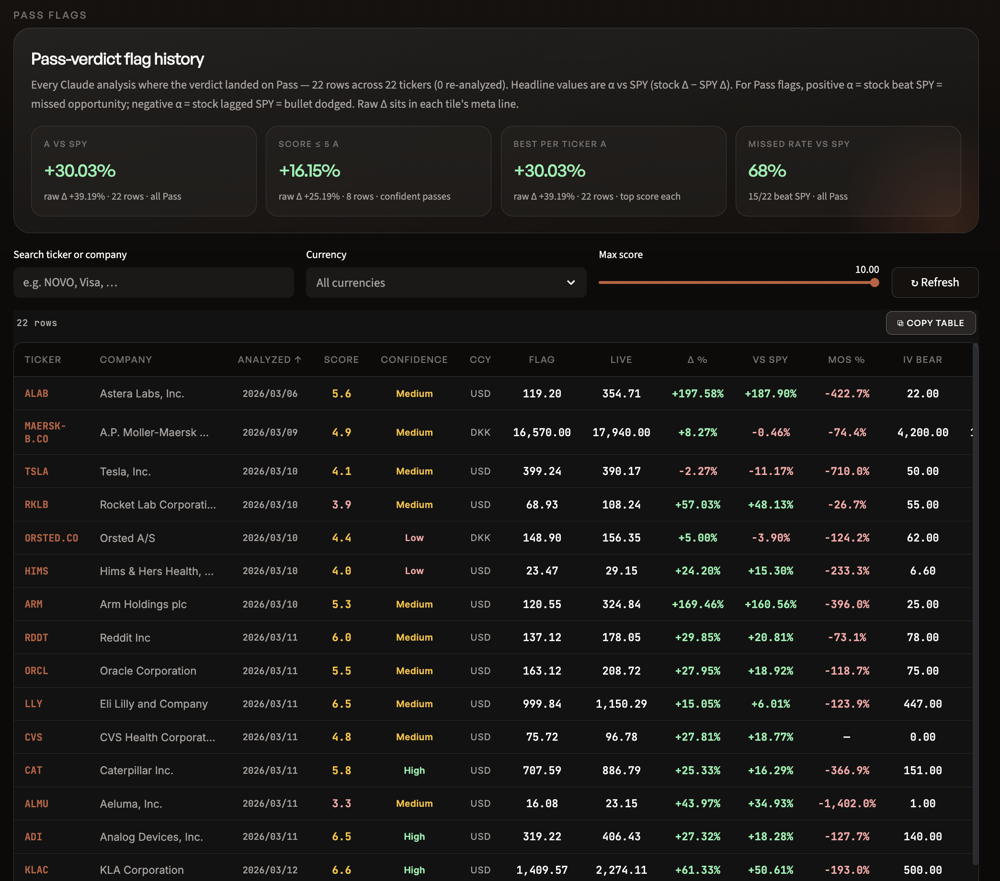

# Investment Analysis Workbench

*[This repo serves as a selective showcase of an ongoing project by me]*  
An attempt to split investment research between AI and humans according to what each side is good at. The AI does the reading: a few hundred tickers scanned every week, triaged down to a handful of deep dives, each run through the same 8-question Buffett-style analysis. Real financial data (yfinance, SEC EDGAR) and a deterministic DCF model anchor the numbers, so the agents reason around verified figures instead of inventing their own. The human keeps the judgment calls: what to buy, when, and how much.

The aim is a reproducible quick scan for businesses worth a closer look. The process doesn't change from week to week, and every verdict is written down, so when it gets something wrong you can go back and see where.

To date: 100+ companies fully analyzed across weekly pipeline cycles, each with a narrative report and a machine-readable JSON summary. Under the hood: Claude Code agents, a quant DCF engine, a paper-trading ledger with a policy engine, and a Streamlit dashboard.

## Dashboard

| Report browser | Research lab |
|:--:|:--:|
|  |  |
| **Own-verdict scoreboard** | **Pass-verdict scoreboard** |
|  |  |

A note on those bottom two panels, because right now they're hilarious: the system grades its own picks against the S&P, and so far the stocks it rejected are winning. Own verdicts have lagged SPY by about 12 points. Pass verdicts beat it by 30, led by Astera Labs, up nearly 200% after the system dismissed it. That's what Buffett-style discipline looks like in an AI melt-up: you pass on every rocket, on purpose, and the scoreboard makes you watch them fly. Keeping that score visible is the point.

## Philosophy

The framework is built around one idea: **buy a wonderful business at a sensible price, with high confidence you understand it.** If you don't have that confidence, the right move is to do nothing.

Every full analysis answers 8 questions, each handled by a specialized agent:

| # | Umbrella | Core Question |
|---|----------|---------------|
| 1 | Circle of Competence | Can you explain how this business makes money in plain language? |
| 2 | Durable Competitive Advantage | Why will this company still be strong in 10 years? |
| 3 | Management & Capital Allocation | Do they act like owners? |
| 4 | Business Economics | High, stable returns on capital — not just growth? |
| 5 | Balance Sheet Safety | Can it survive a bad 2–3 years without raising money? |
| 6 | Valuation vs Intrinsic Value | What is it worth based on owner earnings? |
| 7 | Margin of Safety | Is there a gap between price and conservative value? |
| 8 | Temperament & Time Horizon | If it drops 30% but the business is intact, do you panic? |

Plus a **compact checklist** — 8 forced sentences every investor should be able to recite about any position they own.

## Pipeline

```
Stage A1  Universe Assembly   →  runs/{week}/scan/      150–400 raw names from curated lists,
                                                        watchlist, tracked tickers, web signals
Stage A2  Candidate Filter    →  runs/{week}/scan/      ranked candidate set (80–150 names)
Stage B1  Fast Triage         →  runs/{week}/triage/    mechanical advance/hold/reject pass
Stage B2  Focused Triage      →  runs/{week}/triage/    ≤8 deep dives per cycle, with reasons
Fetch     Financial Data      →  data/context/{TICKER}/      yfinance + SEC EDGAR (XBRL)
Quant     Deterministic DCF   →  data/context/{TICKER}/      bear/base/bull IV, sensitivity, Monte Carlo
Stage C   Full Analysis       →  runs/{week}/reports/   8 umbrellas + checklist + final report
Queue     Living State        →  data/queue/queue.json       every ticker the pipeline has touched
```

Each week's output lives in one folder: `runs/weekNN_DD.MM/{scan,triage,reports}/`. Global state (context, queue, seeds, the SQLite ledger) lives under `data/`.

### Multi-agent analysis

A full analysis spawns agents in parallel batches — a business analyst (umbrellas 1–3), a financial analyst (4–5), and a valuation analyst (6–8) — followed by a checklist agent and a synthesis agent that assembles `FINAL-REPORT.md` and `FINAL-REPORT.json` and updates the queue. All agents follow the same output schema (`prompts/_shared-format.md`): key findings, detailed analysis, bull/bear signal summary, red flags, and a 1–10 score.

### Quant valuation engine (`src/quant/`)

A deterministic multi-stage DCF that runs in under a second with no LLM calls:

- Bear / base / bull per-share intrinsic value
- WACC derived from CAPM (beta, cost of equity, cost of debt)
- Owner earnings with maintenance vs growth capex separation
- 5×5 sensitivity grid across growth rate × WACC
- Monte Carlo (10,000 simulations) producing P(IV > price)

The valuation agents use the quant output as an anchor and stress-test its assumptions; the assembler prefers model IV over AI-estimated IV and records the provenance in the report JSON.

## Portfolio layer

**Paper-trading ledger** (`scripts/paper_trade.py`, SQLite) records buys, sells, shorts, and covers with full transaction history. Every trade passes through a policy engine first: single-name weight caps, sector concentration limits, gross/net exposure bounds, verdict gates (no buying Pass-verdict names), thesis-break blocks, and margin-of-safety warnings.

**Pre-buy checklist** (`scripts/prebuy-check.py`) is a three-condition gate before any buy: quality (verdict, scores), price vs conservative IV, and a written conviction check.

**AI allocator** (`prompts/allocator.md`) produces conviction-weighted portfolio proposals from the report JSONs and live prices. Multiple agent runs are stored side by side and compared on the dashboard.

**Portfolio simulator** (`scripts/portfolio-sim.py`) shows what a snapshot allocation would look like from the current queue — ranked by verdict, score, and confidence.

**Dashboard** (`dashboard/`, Streamlit) — read-only views over the ledger, performance vs SPY, research reports, pre-buy status, the simulator, agent allocation comparisons, and flag tracking.

```bash
./run.sh dashboard    # http://localhost:5050
```

## Commands

Inside Claude Code, natural phrases dispatch the right stage: `run scan`, `triage latest`, `analyze AAPL`, `prebuy GILD`, `buy V`, `show holdings`. The same stages run from the shell:

```bash
./run.sh scan                       # A1 + A2: universe → ranked candidates
./run.sh triage latest              # B1 + B2: candidates → ≤8 deep dives
./run.sh fetch AAPL MSFT            # financial data via yfinance
./run.sh analyze AAPL               # full 8-umbrella analysis + final report
./run.sh prebuy GILD                # three-condition pre-buy gate
./run.sh buy V --price 312.50 --amount 3000 --iv 380
./run.sh holdings                   # current portfolio state
./run.sh ledger refresh             # update prices
./run.sh allocate 250000 --label claude-opus
./run.sh portfolio 250000           # snapshot simulator
./run.sh dashboard                  # Streamlit dashboard
./run.sh snapshot                   # daily performance snapshot
```

The quant engine also runs standalone:

```bash
python3 -m src.quant AAPL --auto-wacc --owner-earnings --sensitivity --monte-carlo
```

## Repository layout

```
prompts/            agent prompts: 8 umbrellas, scan/triage stages, assembler, allocator
src/                portfolio engine, database, snapshots + src/quant/ DCF engine
scripts/            fetch, prebuy, ledger, simulator, allocation tooling
dashboard/          Streamlit app (8 pages)
runs/               weekly pipeline output: scan, triage, reports per week
data/
  context/          per-ticker financials, quant valuations, user research
  queue/            living research queue (state machine per ticker)
  seeds/            watchlist seeds for universe assembly
  db/               SQLite database + schema
portfolio/          ledger state, allocations, pending trades, config
evals/              evidence verification: claim decomposition + accuracy evals
tests/              pytest suite
docs/               architecture notes, plans, analysis notebooks
research-material/  investing research and reference notes
```

## Research queue

`data/queue/queue.json` tracks the state of every ticker the pipeline has touched:

`inbox` → `triage` → `watchlist` / `deep_research` → `monitor_only` / `approved` / `owned` / `rejected`

Triage (B2) and analysis (assembler) update it automatically; `approved` and `owned` are manual decisions.

## Verdicts

- **Own** — average score ≥ 7, no umbrella below 4, margin of safety ≥ 6. A business you'd hold for 5+ years.
- **Watch** — average 5–7 or one critical weakness. Interesting, but needs a better price or more conviction.
- **Pass** — average < 5, multiple weak scores, or no margin of safety.

## Setup

```bash
pip install -r requirements.txt     # yfinance, streamlit, plotly, edgartools, pydantic
```

The analysis stages require the [Claude Code CLI](https://docs.anthropic.com/en/docs/claude-code) installed and authenticated. The quant engine, ledger, simulator, and dashboard run without it.

## Disclaimer

This is an analysis framework and a paper-trading system, not financial advice. All positions are simulated. Analysis is generated by AI and may contain errors. Do your own research and consult qualified professionals before making investment decisions.
