# Pipeline Architecture

```mermaid
flowchart TD
    classDef source fill:#e8f5e9,stroke:#2e7d32,color:#1b5e20
    classDef scan fill:#e3f2fd,stroke:#1565c0,color:#0d47a1
    classDef triage fill:#fff3e0,stroke:#e65100,color:#bf360c
    classDef fetch fill:#f3e5f5,stroke:#6a1b9a,color:#4a148c
    classDef analysis fill:#fce4ec,stroke:#c62828,color:#b71c1c
    classDef queuecls fill:#fff9c4,stroke:#f9a825,color:#f57f17
    classDef portfolio fill:#e0f2f1,stroke:#00695c,color:#004d40
    classDef dbcls fill:#eceff1,stroke:#37474f,color:#263238
    classDef dash fill:#ede7f6,stroke:#4527a0,color:#311b92
    classDef evidence fill:#fbe9e7,stroke:#d84315,color:#bf360c
    classDef quant fill:#e8eaf6,stroke:#283593,color:#1a237e

    %% ===== INPUT SOURCES =====
    subgraph SOURCES["INPUT SOURCES"]
        direction LR
        S1["data/seeds/watchlist.json"]:::source
        S2["Tracked Reports<br/>runs/*/reports/"]:::source
        S3["8 Curated Sector Lists"]:::source
        S4["Web Searches<br/>6 event/signal queries"]:::source
    end

    %% ===== STAGE A: SCAN =====
    subgraph STAGE_A["STAGE A: SCAN &mdash; runs/week/scan/"]
        A1["A1: Universe Assembly<br/>scan-stage-a1.md"]:::scan
        A1_OUT["universe.json<br/>150-400 raw names"]:::scan
        A2["A2: Candidate Filter<br/>scan-stage-a2.md"]:::scan
        A2_OUT["candidates.json<br/>80-150 ranked"]:::scan
        A2_META["scan-meta.json"]:::scan
        A1 --> A1_OUT --> A2
        A2 --> A2_OUT
        A2 --> A2_META
    end

    S1 --> A1
    S2 --> A1
    S3 --> A1
    S4 --> A1

    %% ===== STAGE B: TRIAGE =====
    subgraph STAGE_B["STAGE B: TRIAGE &mdash; runs/week/triage/"]
        B1["B1: Fast Triage<br/>No web search"]:::triage
        B1_ADV["b1-advance.json<br/>survivors"]:::triage
        B1_HOLD["b1 hold + reject"]:::triage
        B2["B2: Focused Triage<br/>3-5 web lookups"]:::triage
        B2_OUT["triage.json"]:::triage
        B2_CSV["deep-dive.csv<br/>max 8 names"]:::triage
        B1 --> B1_ADV --> B2
        B1 --> B1_HOLD
        B2 --> B2_OUT
        B2 --> B2_CSV
    end

    A2_OUT --> B1
    A2_META --> B2

    %% ===== QUEUE =====
    QUEUE["QUEUE<br/>data/queue/queue.json<br/>inbox | watchlist | deep_research<br/>monitor_only | approved | owned | rejected"]:::queuecls

    B2 -->|"state updates"| QUEUE
    B1_HOLD -->|"inbox + rejected"| QUEUE

    %% ===== FETCH / CONTEXT =====
    subgraph FETCH["DATA FETCH LAYER"]
        FETCH_FIN["fetch-financials.py<br/>yfinance &bull; 24h cache"]:::fetch
        FETCH_EDGAR["fetch-edgar.py<br/>SEC EDGAR XBRL"]:::fetch
        USER_CTX["User Context Files<br/>10-K notes, transcripts"]:::fetch
        CTX["data/context/TICKER/<br/>financials.md + extras +<br/>quant-valuation.md/.json"]:::fetch
        FETCH_FIN --> CTX
        FETCH_EDGAR -->|"optional .md"| CTX
        USER_CTX --> CTX
    end

    %% ===== STAGE C: FULL ANALYSIS =====
    subgraph STAGE_C["STAGE C: FULL ANALYSIS &mdash; runs/week/reports/TICKER/"]

        subgraph PAR["3 Parallel Agent Batches"]
            direction LR
            subgraph BA["Business Analyst"]
                U1["01 Circle of<br/>Competence"]:::analysis
                U2["02 Competitive<br/>Advantage"]:::analysis
                U3["03 Management &<br/>Capital Allocation"]:::analysis
            end
            subgraph FA["Financial Analyst"]
                U4["04 Business<br/>Economics"]:::analysis
                U5["05 Balance<br/>Sheet Safety"]:::analysis
            end
            subgraph VA["Valuation Analyst"]
                U6["06 Valuation &<br/>Intrinsic Value"]:::analysis
                U7["07 Margin of<br/>Safety"]:::analysis
                U8["08 Temperament &<br/>Time Horizon"]:::analysis
            end
        end

        SECTIONS["8 Section .md Files"]:::analysis
        CHECK["09 Compact Checklist<br/>reads 01-08"]:::analysis
        ASM["Assembler Agent<br/>reads 01-09"]:::analysis
        REPORT_MD["FINAL-REPORT.md<br/>full narrative"]:::analysis
        REPORT_JSON["FINAL-REPORT.json<br/>verdict + scores + IV"]:::analysis

        U1 --> SECTIONS
        U2 --> SECTIONS
        U3 --> SECTIONS
        U4 --> SECTIONS
        U5 --> SECTIONS
        U6 --> SECTIONS
        U7 --> SECTIONS
        U8 --> SECTIONS
        SECTIONS --> CHECK --> ASM
        ASM --> REPORT_MD
        ASM --> REPORT_JSON
    end

    B2_CSV -->|"deep_dive tickers"| STAGE_C
    CTX -->|"financial context"| PAR
    ASM -->|"verdict + date"| QUEUE

    %% ===== QUANT MODELS =====
    subgraph QUANT_M["QUANT MODELS &mdash; src/quant/"]
        direction LR
        PARSE["parser.py<br/>Parse financials"]:::quant
        DCFM["DCF Engine<br/>3 scenarios"]:::quant
        WACCM["WACC<br/>CAPM"]:::quant
        MCM["Monte Carlo<br/>10K sims"]:::quant
        SENSM["Sensitivity<br/>Grid"]:::quant
        PARSE --> DCFM
        WACCM --> DCFM
        DCFM --> MCM
        DCFM --> SENSM
    end

    CTX -->|"parse financials"| PARSE
    SENSM -->|"quant-valuation.md/.json"| CTX
    CTX -->|"quant IV anchor"| U6
    CTX -->|"quant MOS/MC data"| U7
    CTX -->|"quant-valuation.json"| ASM

    %% ===== EVIDENCE SYSTEM =====
    subgraph EV["EVIDENCE SYSTEM &mdash; data/db/portfolio.db"]
        SRC_D["source_documents"]:::evidence
        EXT_F["extracted_facts"]:::evidence
        VER["verify_claims.py<br/>fact-check"]:::evidence
        ASRT["assertions +<br/>assertion_evidence"]:::evidence
        SDIFF["semantic-diff.py<br/>cross-period compare"]:::evidence
        SRC_D --> EXT_F
        EXT_F --> VER --> ASRT
        EXT_F --> SDIFF
    end

    FETCH_EDGAR -->|"filing data"| SRC_D
    REPORT_MD -->|"claims to check"| VER

    %% ===== DATABASE =====
    subgraph DB["SQLite &mdash; data/db/portfolio.db"]
        direction LR
        POS["positions"]:::dbcls
        LOTS["lots"]:::dbcls
        TXN["transactions"]:::dbcls
        SNAPS["portfolio_snapshots"]:::dbcls
        PB_T["prebuy_checks"]:::dbcls
        PROP["trade_proposals"]:::dbcls
    end

    %% ===== PORTFOLIO OPERATIONS =====
    subgraph PORT["PORTFOLIO OPERATIONS"]

        subgraph ALLOC["AI ALLOCATOR"]
            AINPUT["allocation-input.py<br/>Build data blob"]:::portfolio
            AAGENT["Allocator Agent<br/>allocator.md"]:::portfolio
            AOUT["allocation-proposal<br/>.json + .md"]:::portfolio
            AINPUT --> AAGENT --> AOUT
        end

        PREBUY["Pre-Buy Check<br/>C1 Quality Gate<br/>C2 Price vs IV<br/>C3 Conviction"]:::portfolio

        subgraph TRADING["PAPER TRADING"]
            POLICY["Policy Engine<br/>7 hard + 5 soft rules"]:::portfolio
            TRADE["paper_trade.py<br/>buy / sell / short / cover"]:::portfolio
            POLICY --> TRADE
        end

        SNAP_ENG["snapshot.py<br/>Daily captures"]:::portfolio
        PSIM["portfolio-sim.py<br/>Hypothetical allocation"]:::portfolio
    end

    QUEUE -->|"queue entries"| AINPUT
    REPORT_JSON -->|"report data"| AINPUT
    CTX -->|"live prices"| AINPUT
    POS -->|"current holdings"| AINPUT

    QUEUE -->|"verdict + state"| PREBUY
    REPORT_JSON -->|"scores + IV"| PREBUY
    PREBUY -->|"log"| PB_T

    QUEUE -->|"verdict check"| POLICY
    REPORT_JSON -->|"thesis status"| POLICY
    TRADE --> POS
    TRADE --> LOTS
    TRADE --> TXN
    POLICY -->|"log"| PROP

    POS -->|"portfolio state"| SNAP_ENG
    SNAP_ENG --> SNAPS

    QUEUE -->|"eligible tickers"| PSIM
    REPORT_JSON -->|"scores + verdicts"| PSIM

    %% ===== DASHBOARD =====
    subgraph DASH["STREAMLIT DASHBOARD &mdash; 5 Pages"]
        direction LR
        D1["Portfolio<br/>Holdings, sectors,<br/>policy flags"]:::dash
        D2["Performance<br/>Return vs SPY,<br/>monthly heatmap"]:::dash
        D3["Research<br/>Verdict, scores,<br/>full report"]:::dash
        D4["Pre-Buy<br/>C1/C2 gates for<br/>Own + Watch"]:::dash
        D5["Simulator<br/>What-if<br/>allocation"]:::dash
    end

    POS --> D1
    TXN --> D1
    SNAPS --> D2
    QUEUE --> D3
    REPORT_JSON --> D3
    REPORT_MD --> D3
    QUEUE --> D4
    REPORT_JSON --> D4
    QUEUE --> D5
    REPORT_JSON --> D5

    %% ===== FEEDBACK LOOPS =====
    REPORT_MD -.->|"existing reports<br/>for refresh check"| B2
    REPORT_JSON -.->|"tracked tickers<br/>feed next scan cycle"| S2
```

## Color Legend

| Color | Area |
|-------|------|
| Green | Input Sources |
| Blue | Stage A &mdash; Scan (Universe + Filter) |
| Orange | Stage B &mdash; Triage (Fast + Focused) |
| Purple | Data Fetch Layer (yfinance, EDGAR, user files) |
| Red/Pink | Stage C &mdash; Full 8-Umbrella Analysis |
| Yellow | Queue &mdash; Central State (queue.json) |
| Teal | Portfolio Operations (Allocator, Pre-Buy, Trading, Sim) |
| Gray | Database Tables (SQLite) |
| Lavender | Dashboard Pages (Streamlit) |
| Deep Orange | Evidence System (SEC filings, claims, diffs) |
| Indigo | Quant Models (DCF, WACC, Monte Carlo) |

## Key Data Flows

1. **Main pipeline** flows top-to-bottom: Sources &rarr; A1 &rarr; A2 &rarr; B1 &rarr; B2 &rarr; Fetch &rarr; Quant &rarr; Stage C &rarr; Queue
2. **Stage C parallelism**: 3 agent batches run concurrently (Business, Financial, Valuation), then Checklist and Assembler run sequentially
3. **Quant models run before agents**: `src/quant` parses `financials.md`, runs DCF + WACC + Monte Carlo + sensitivity + owner earnings, and writes `quant-valuation.md` + `.json` to `data/context/{TICKER}/`. All analysis agents receive this as context. The Valuation Agent (06) uses it as its starting anchor. The Assembler prefers quant-model IV over AI-extracted IV when populating FINAL-REPORT.json.
4. **Queue is the central hub**: written by B2 and the Assembler; read by Allocator, Pre-Buy, Portfolio Sim, Policy Engine, and all Dashboard pages
5. **FINAL-REPORT.json is the key artifact**: consumed by Allocator, Pre-Buy, Policy Engine, Simulator, and 3 Dashboard pages. Now includes `iv_source` (quant_model vs ai_estimate), `monte_carlo_prob_above_price`, and `sensitivity_iv_range`.
6. **Two feedback loops** (dashed): reports feed back into B2 for refresh checks, and into the next scan cycle as tracked tickers
7. **Evidence system** runs in parallel: EDGAR fetch &rarr; source_documents &rarr; extracted_facts &rarr; verify_claims &rarr; assertions
